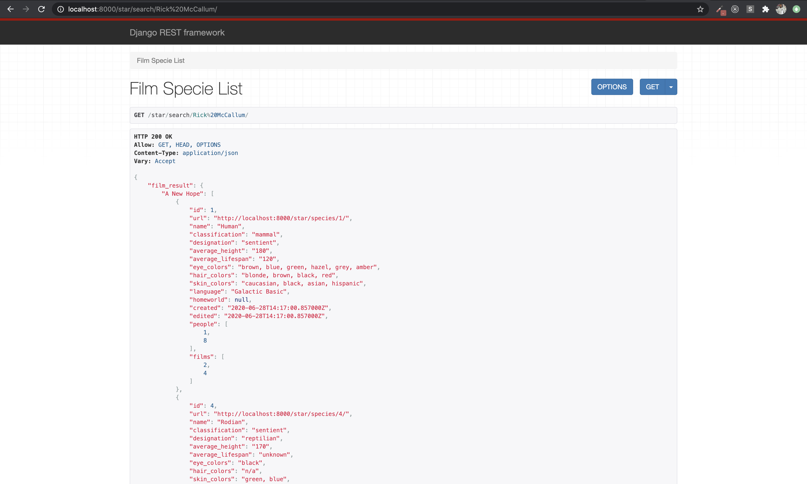
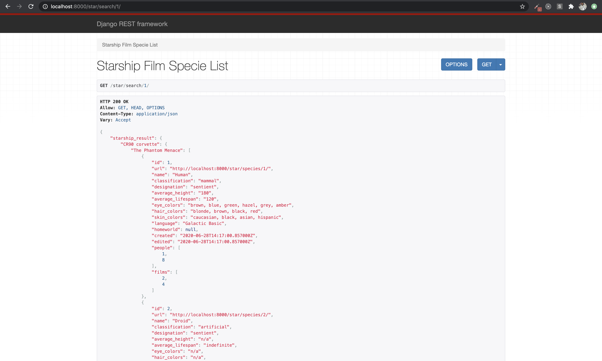
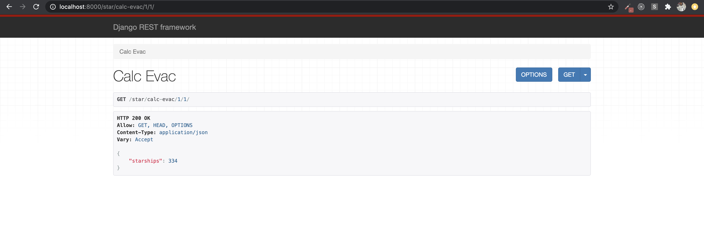
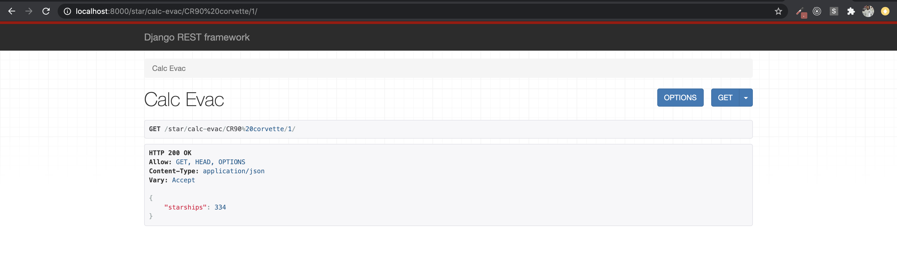
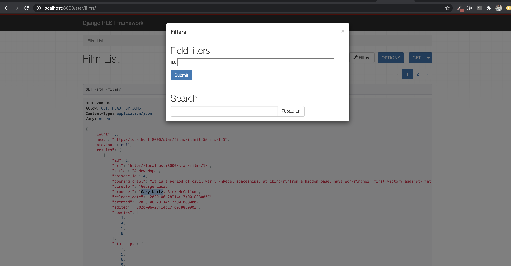
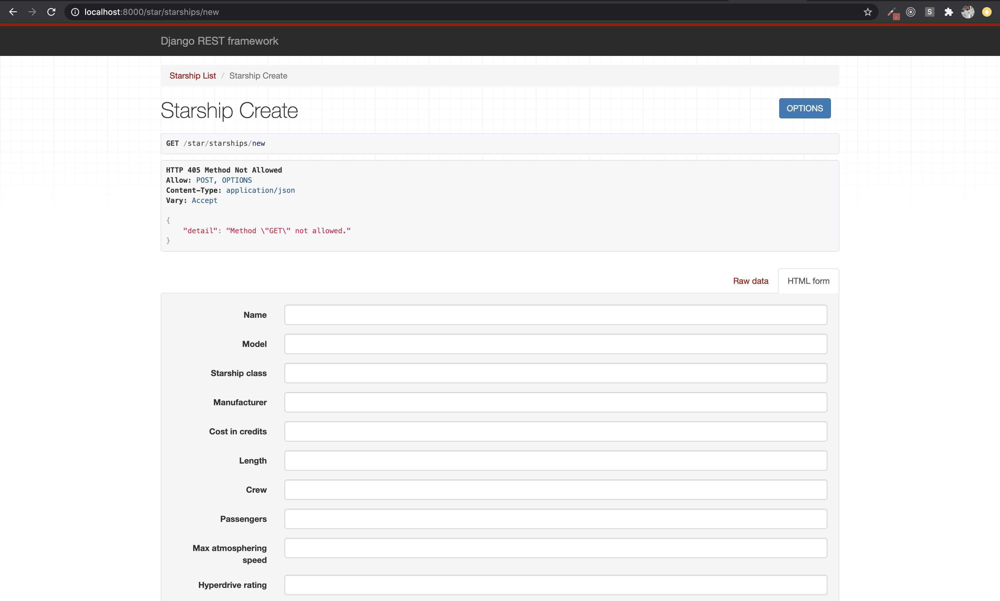
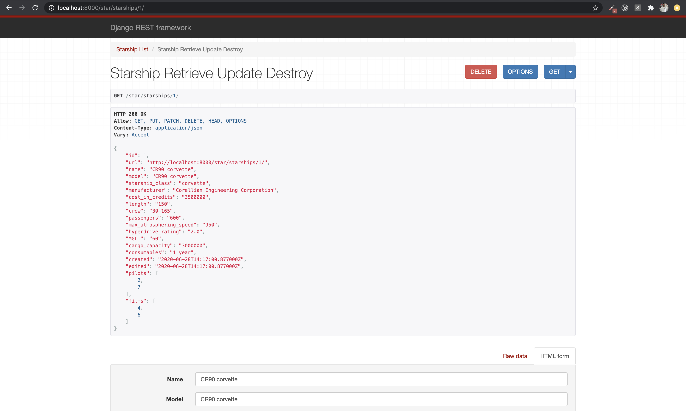
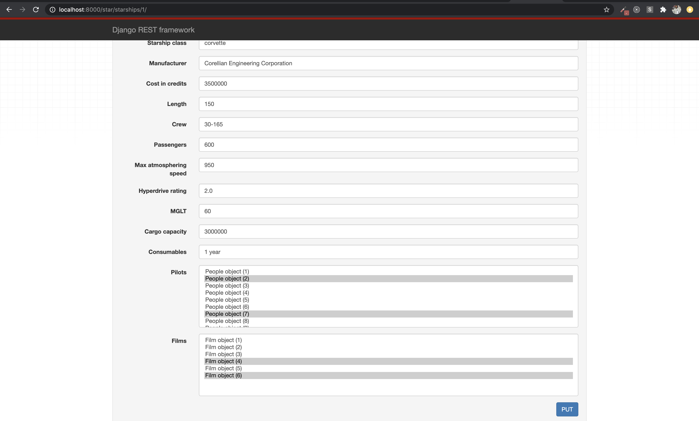

# Solution Explanation for the Star App

The entire solution to the task is in the **star** app.

## Setup

```
$  python3 -m venv venv
$ source venv/bin/activate
$ pip install -r requirements.txt
$ python manage.py makemigrations star
$ python manage.py migrate
```

## Load Initail Test Data

```
$ python manage.py loaddata star_data.json (Data I downloaded from https://swapi.dev/)
```

## Starting Up The Dev Server

```
$ python manage.py createsuperuser (if you want play with the models in the admin section)
$ python manage.py runserver
```

## Tests

```
$ python manage.py test
```

## Explanation

- models.py contains People, Film, Starship, Planet, Specie, Vehicle models with exact attributes from https://swapi.dev/.
- admin.py registered all models into the admin backend.
- serializers.py file contains ModelSerializer serializers for all the models.
- Serializers also including two specials serializers called **StarshipFilmSpecieSerializer** and **FilmSpecieSerializer**
  which I used to serialize the Starship(id), Film(producer) to Specie search results from problem 1. I decided to serialize the results that way
  because I wanted to be creative in displaying the results in a step map from Starship(name) -> Film(Title) -> (Specie) instead of just displaying
  the serialized Species objects, which would have been simpler.
- views.py contains ListAPIView for all the models with support for Pagination, Search and Filtering. Also, a CreateAPIView and RetrieveUpdateDestroyAPIView
  for complete CRUD capabilities of the Starship model.
- views.py also contains two GenericAPIView for Starship(id), Film(producer) to Specie search in problem 1 and another GenericAPIView for Starship/Planet evacuation calculation.
- url.py contains list links for all the models, crud links for the Starship model, search links for Starship(id), Film(producer) to Specie search and a link for Starship/Planet evacuation calculation.

## Basic HTTP Request Usage

### Model List Views

```
GET http://localhost:8000/star/people/
GET http://localhost:8000/star/starships/
GET http://localhost:8000/star/planets/
GET http://localhost:8000/star/species/
GET http://localhost:8000/star/films/
GET http://localhost:8000/star/vehicles/
```

### Starship CRUD

```
POST http://localhost:8000/star/starships/new
GET http://localhost:8000/star/starships/<int:id>/

example: GET http://localhost:8000/star/starships/1/
```

### Starship(id), Film(producer) to Specie search

The search result is done from one url in the frontend, but seperated to two urls by a **int/str** path regular expressions in urls.py and the request is routed to the two GenericAPIView classes **StarshipFilmSpecieList** and **FilmSpecieList** in views.py, depending on whether the search url contained the Starship(id) or Film(producer name).
I decided to have two serializers and two views because I didn't want to clutter the whole logic in one view. The search results are displayed in a step map from Starship(name) -> Film(Title) -> (Specie object), because I was feeling creative.

```

GET http://localhost:8000/star/search/<int:id>/ (Starship id)

or GET http://localhost:8000/star/search/<str:producer>/ (Film producer)

example: GET http://localhost:8000/star/search/1/
         GET http://localhost:8000/star/search/Gary Kurtz
```

### Starship/Planet evacuation calculation.

The search result is done from one url in the frontend and one **int/str** path regular expressions url in urls.py and the request is routed to the **CalcEvac** GenericAPIView class in views.py, depending on whether the search url contains the Starship(id)/Planet(id) or Starship(name)/Planet(id). The one view handles both case because the logic wasn't too cluttering. The result is just the number of starships that it will take to evacute the planet(id).

```

GET http://localhost:8000/star/calc-evac/<str:ship>/<int:id>/   (starship(name or id)/planet(1))

example: GET http://localhost:8000/star/calc-evac/1/1/
         GET http://localhost:8000/star/calc-evac/CR90 corvette/1/
```

## Fixes on the utils/units.py file

- Made the utils/units.py better by adding a utility class that does brain surgery on the Units class by taking ownership of the \***\*get\*\*** and \***\*set\*\*** methods of it's instances, because what else can say? I just wanted to use a different approach (smiles, you can't blame a man for trying).

## screenshots









